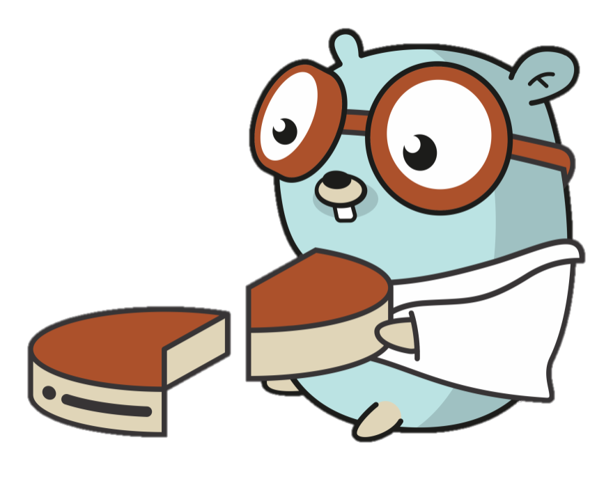

# Sci-Go

## The Go Data Science Library



This library has been developed with an idiomatic design process, and inspiration from a few sources.

<ul>
<li><a>Go Proverbs With Rob Pike</a href="https://www.youtube.com/watch?v=PAAkCSZUG1c"></li>
</ul>

## Installing

Sci-Go currently has no non-stdlib dependencies, so installing it and getting started is rather easy.

```bash
go get -u deleomike/sci-go
```

## Usage

There are a lot of things in the [works](https://github.com/deleomike/sci-go/issues/1), but right now we have these feature sets implemented.

* [Clustering](./pkg/cluster/README.md)
    * KMeans

## Support the Project

I appreciate all contributions and sponsorships for this project.
